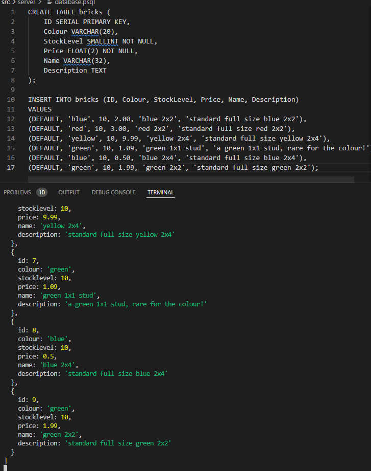
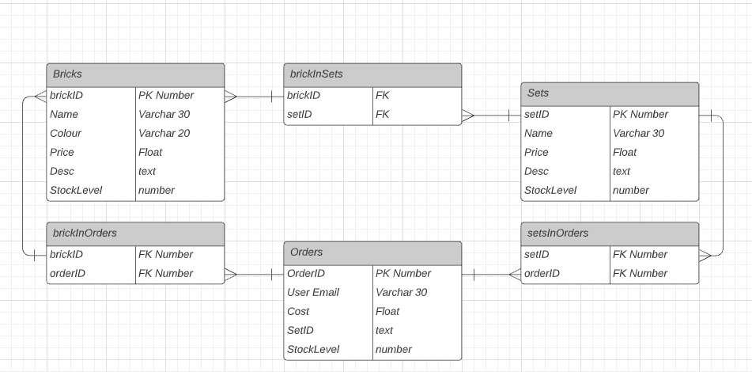
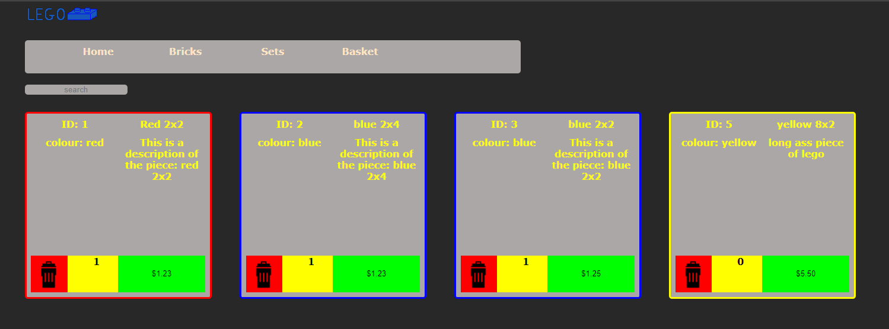
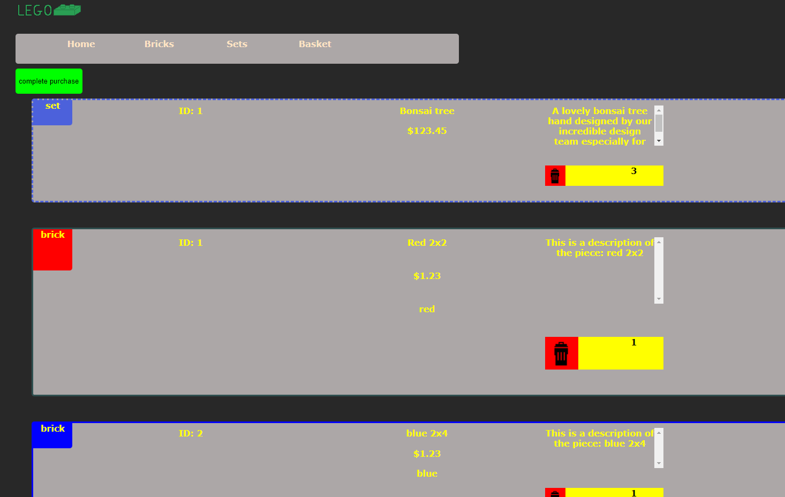

# _Lego Store_

## Instructions

### Setup

requirements:

- psql
- node
- npm

npm run setup:

- runs npm i
- creates psql database and pipes the output of ./src/server/database.sql into it
- you must enter your posgres default user password in order to create the role for the server

npm start:

- starts server

### Usage

go to http://localhost:8080/

home page displays users favourites, suggested (both static for now)

change pages by clicking the navbar

in the bricks page find a full list of all the bricks on the database. 
in the sets page same story

add items from sets and bricks to your basket, total price will be displayed along with the amount of each item and some item info

confirm purchase to go to fake window which would handle payment

login/logout does not work. The login button takes you to the admin page (also non-functional) which would be used to update stock levels, change prices etc and generally manage the store. Logout is non-functional.

## Coding

### pages

All statically served to the clients, not sure if this is the best way to do it, may impliment server side page changing later but for now this works.
Admin is currently statically served but this needs to be changed when login becomes implemented

## End users

the end users will be people who are looking to buy lego bricks from many age ranges and also people who want to sell bricks. In this case the seller has been defined as one person: the store owner.

### what do they expect to see

end users need to be able to:

- easily navigate the website

- see all the lego bricks available

- add bricks to a basket

- checkout & pay

## breakdown

- # server

  - endpoints
    - /query_brick

      fetch a specific bricks information from the database searchable by ID

    - /query_set

      fetch a specific sets information from the database
      also fetch any related bricks, to a certain extent, ID's

    - query_many_bricks &
    - query_many_sets

      fetch brick or set information by a variable scopes, ID name price currently all(bool) currently allowed

   - database integration

- # database

  ;

  these database items should be everything required to run the current state of the website
  along with allowing for some future implimentations (such as delivery tracking)

<!-- ERD NEEDED -->

- # client
  - ## home page

    the home page should have a curated mix of sets and bricks available. These can be changed at any time by the owner.
    It should also have the links to all other pages clearly displayed.

  - ## basket

    the basket should fetch whatever the user has got stored in their basket from the current shop and display it on the page where they can decide to purchase or not.

    the basket should be kept in localstorage

  - ## bricks page

    figure 1, the idea is that when a brick is hovered over by the mouse, it gets larger and more information is displayed.

  - ## sets page

    similar to figure 1, however instead of brick information being displayed, when a set is hovered over,
    it shows the individual pieces (if available) and a link to more information about them.

  
  
  
  

# PROGRESS

  ### progress 1
    
    completed some functionality.

    very basic in design and functionality. Client fetches data from the server (data stored in a json for now) and displays in these item holders. Filter has an inadequate event listener that can update the page. Navbar works, but can be improved.
    Used objects as the parameters in ./src/public/requests.mjs so that the requests can be flexible with parameters

  ### progress 2

    added search bar

    got some advanced functionality. Can search any aspect of the brick. Can be improved, for example doesn't search for words in description just compares search value. <- will test this with a larger sample of bricks to check efficiency.

  ### progress 3

    added basket functionality ustilising localstorage.
    styling can be improved but is semi-functional for now at least
  
    erd is not complex and fairly simple to implement.
    will have the setup (npm run setup) start a database for the submission. Real function would have a permanent database.

## progress 4

    fully added bricks, sets and basket client side,
    these will need updating once the database is working to include sets linking to bricks.
    Started working on database
  
    Here is a picture of the server getting output from the database and the psql commands used to create the basic server
    Still need to figure out the best way to have the PC connect to the database
  
    update on the bricks page, going for a childish nostalgic look
  
    basket working as intended, mostly happy with the way this looks.
    made custom logo too:
  

## progress 5

  fully implemented public client
  login does not work. Followed tutorials, tried different pieces of code etc. Will be unable to implement due to time constraints
  Database functions with sets, bricks, bricksinsets
  Npm run setup creates DB
  client can keep track of stock
  going to work on admin pannel 
    note: admin pannel would be hidden behind a login wall in production
