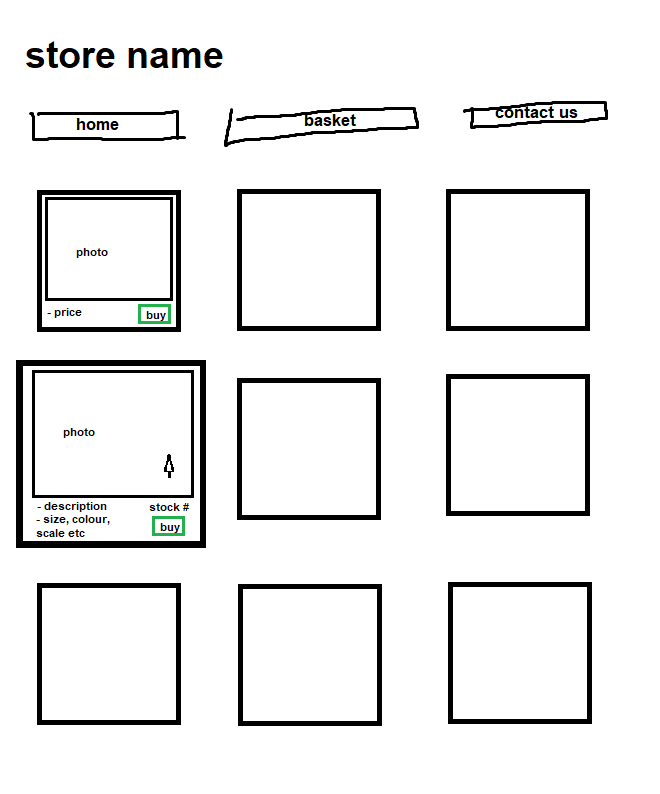
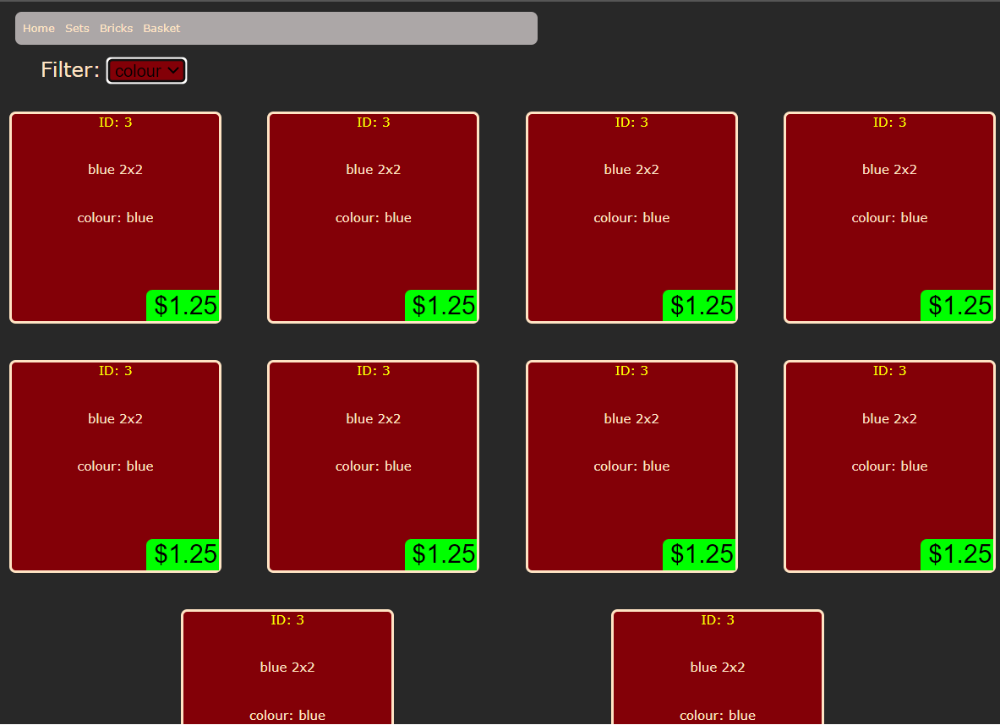
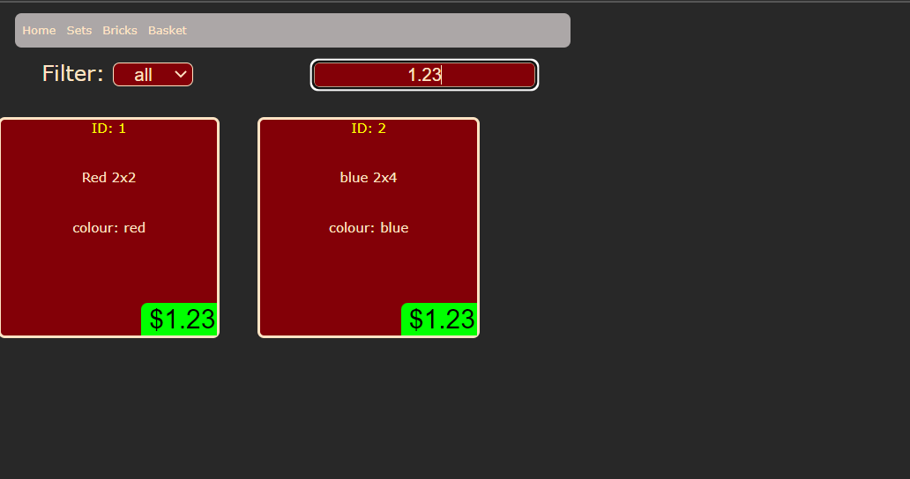
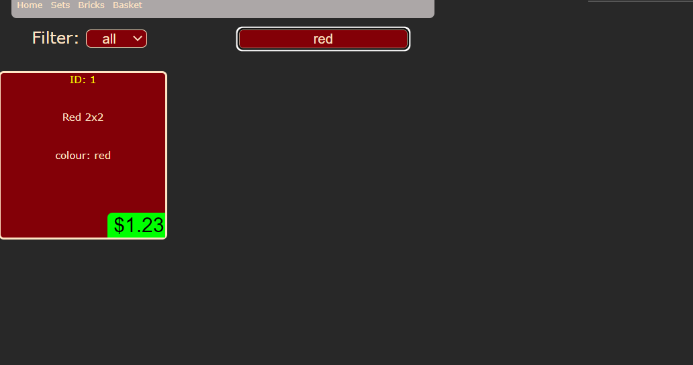

# _Lego Store_

## Coding

### pages

All statically served to the clients, not sure if this is the best way to do it, may impliment server side page changing later but for now this works.

### casing

FunctionsLikeThis

variablesLikeThis

filesLike.this

## End users

the end users will be people who are looking to buy lego bricks from many age ranges and also people who want to sell bricks. In this case the seller has been defined as one person: the store owner.

### what do they expect to see

end users need to be able to:

- easily navigate the website
  - after doing a basic outline of the navigation bar, I got feedback which said the basket and contact us would be better as icons (basket and phone respectively)

- see all the lego bricks available

- add bricks to a basket

- checkout & pay

### to do

- design a home page

- design a store page

- design a basket page

- database
  - design a database system that is accessible for the server.
  - impliment the database system

### done

### maybe

## breakdown

- # server

  - endpoints
    - /fetchBrick

      fetch a specific bricks information from the database searchable by ID, Price or Colour.
    - /fetchSet

      fetch a specific sets information from the database
      also fetch any related bricks, to a certain extent, ID's and amount of bricks in an object
  - database integration

- # database

  - curated page
    - setID's
    - brickID's

  - user storage
    - username
    - previous orders
    - basketID
  
  - baskets
    - lastupdate
    - brickIDs
    - setIDs

  - brick storage
    - brick number
    - colour
    - amount in stock
    - price

  - orders
    - items included
    - date
    - time
    - delivery status

  these database items should be everything required to run the current state of the website
  along with allowing for some future implimentations (such as delivery tracking)

<!-- ERD NEEDED -->

- # client
  - ## home page

    the home page should have a curated mix of sets and bricks available. These can be changed at any time by the owner.
    It should also have the links to all other pages clearly displayed.

  - ## basket

    the basket should fetch whatever the user has got stored in their basket from the current shop and display it on the page where they can decide to purchase or not.

    the basket database section should be written in such a way that the basket does not exist in the database forever,
     instead keeping track of how long it has been active for.

  - ## bricks page

    figure 1, the idea is that when a brick is hovered over by the mouse, it gets larger and more information is displayed.

  - ## sets page

    similar to figure 1, however instead of brick information being displayed, when a set is hovered over,
    it shows the individual pieces (if available) and a link to more information about them.

  
  
  
  

    ### progress 1
    
    completed some functionality.

    very basic in design and functionality. Client fetches data from the server (data stored in a json for now) and displays in these item holders. Filter has an inadequate event listener that can update the page. Navbar works, but can be improved.

    ### progress 2

    added search bar

    got some advanced functionality. Can search any aspect of the brick. Can be improved, for example doesn't search for words in description just compares search value. <- will test this with a larger sample of bricks to check efficiency.